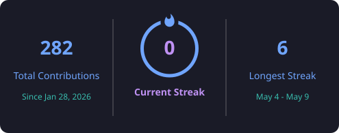

<h1 align="center">
  
</h1>

<div align="center">
  
</div>

</div>

---

# 💼 About Me

```python
class CollinsIkiara:
    role = "Backend Developer"
    location = "Nairobi, Kenya 🇰🇪"
    fun_fact = "Former Electrical Engineer ⚡"
```

---

# 🎯 Current Focus

* 🔨 Building scalable backend applications
* 🏛️ Studying System Design and Software Architecture
* ⚙️ Writing clean, maintainable APIs
* 🌱 Learning modern frameworks and technologies
* 🤝 Contributing to collaborative software projects

---

# 🛠️ Tech Stack

### Languages

<p align="center">
  
</p>

### Backend

<p align="center">
  
</p>

### Frontend

<p align="center">
  
</p>

### Dev Tools

<p align="center">
  
</p>

<p align="center">
  
  
  
</p>

---

## 📊 GitHub Stats

<div align="center">

  

  

  <br/>

  

</div>

---

# 📚 Currently Learning

* 🏛️ System Design
* ⚡ Nest.js
* 🎨 Vue.js
* 🖼️ Nuxt.js
* 🐳 Docker

---

# ☕ Beyond Coding

* ⚽ Play football regularly
* 📚 Educating myself through philosophical books and Scripture
* 🎥 Unwind by watching tons of YouTube documentaries
* 🌱 Always exploring modern frameworks and technologies

---

# 🤝 Let's Connect

<p align="center">

<a href="https://www.linkedin.com/in/collins-ikiara/">

</a>

<a href="mailto:ikiaracollins@gmail.com">

</a>

<a href="https://collinsikiara-portfolio.vercel.app">

</a>

</p>

---

<div align="center">

### 💬 Favorite Quote

> *“There is no place like 127.0.0.1.”* — Anonymous

</div>

<h1 align="center">
  
</h1>
